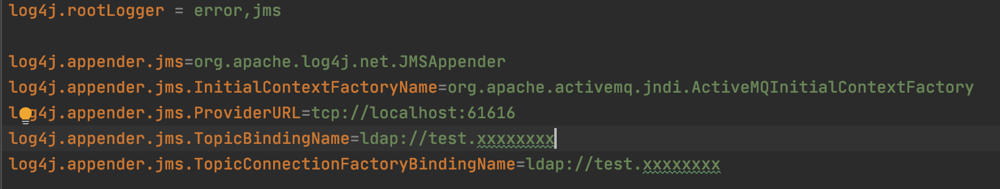
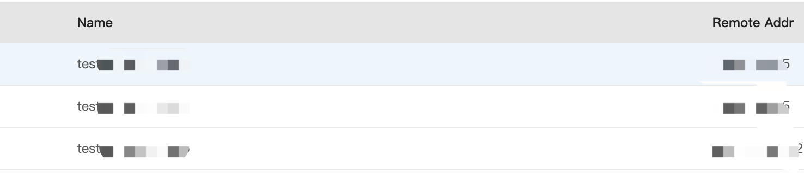

# Log4jShell_1.x

Log4j RCE 1.x Poc

## Attack

## Restriction

1. The target has jms environment
2. You need to gain access to modify the log4j.properties file

## Conclusion

Not as useful as log4shell 2.x

## Log4shell Topic

https://github.com/cckuailong/reapoc/tree/main/Topic/Log4j

## Welcome to contribute in reapoc

https://github.com/cckuailong/reapoc
